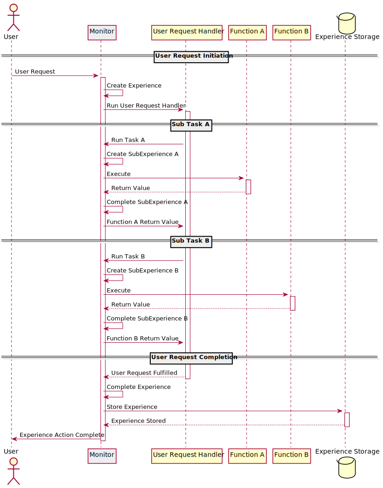

# Experience Monitor

Experience monitor records user experience. Once experience is started, experience monitor intercepts
tracked function calls using Proxy and wrapper functions. It can also send experience from one execution
space to the other using wrappers around message handler function. Such functions invisibly attaches
an experience object to the message and detaches it once it arrives to the destination.

## Sequence diagram



## Stateful Functions
All functions that are tracked by an experience monitor should be stateful. 

A stateful function should take a state object as its last argument. Return value of a stateful function
should be an object with value and state properties:
```
{
  value: functionReturnValue,
  state: stateObject
}  
```
`functionReturnValue` is a value that a function should return (it can be undefined if function has
no value to return). `stateObject` is an object that was passed to a statefull function as its last
argument.

Statefull functions do not manipulate the state object. Statefull functions are state aware: they pass
a state object to other statefull functions and retrun it to the caller. However, they are not
aware of what state object is and what information it contains. Statefull functions are not supposed
to manipulate state object properties in any way.


If an error value is thrown by a statefull function it should also follow an object pattern shown above.
If a statefull function contains a regular function that is not state-aware and that function might throw
an error, this error value should be caught, wrapped into an object as above, and rethrown.